# How to Play Pusoy Dos

Pusoy Dos (also called **Filipino Big Two**) is a four-player card game about getting rid of your cards before everyone else does. You play one human seat against three computer opponents, over **five Rounds**, and the player with the most points at the end wins.

You do not need to know the game already. Read the [60-second version](#the-game-in-60-seconds), then come back to the details whenever a question comes up.

> **\* = house rule.** An asterisk marks a rule that this game defines in its own way. Other Pusoy Dos / Big Two groups often play these points differently, so if you know the game from somewhere else, watch for the asterisks. They are also collected in [House rules at a glance](#house-rules-at-a-glance).

## Contents

1. [The game in 60 seconds](#the-game-in-60-seconds)
2. [The cards](#the-cards)
3. [Starting a Round](#starting-a-round)
4. [What you can play (combinations)](#what-you-can-play-combinations)
5. [Taking your turn](#taking-your-turn)
6. [Going out and finishing a Round](#going-out-and-finishing-a-round)
7. [Scoring and winning](#scoring-and-winning)
8. [Playing in this app](#playing-in-this-app)
9. [Tips for new players](#tips-for-new-players)
10. [House rules at a glance](#house-rules-at-a-glance)
11. [Quick reference](#quick-reference)
12. [FAQ](#faq)

---

## The game in 60 seconds

1. There are **4 players** and a normal **52-card deck** (no jokers). Each player gets **13 cards**.
2. Whoever holds the **3 of Clubs** (the lowest card) goes first, and must play something that includes it.\*
3. Players take turns clockwise. On your turn you either **play a combination that beats the last one played**, or you **pass**.
4. Once everybody else has passed, the last player who played gets a **free lead**: they start a new trick with any combination they like.
5. Empty your hand to go out. The first three players out finish 1st, 2nd and 3rd; the one left holding cards is 4th.\*
6. Placements score points (5 / 3 / 2 / 0).\* Play **five Rounds**, and the highest total wins.\*

---

## The cards

### Rank: which cards are higher

From lowest to highest:

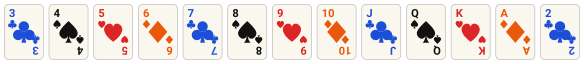

The **2 is the highest card**, above the Ace. The **3 is the lowest**.

### Suit: the tie-breaker

When two cards have the same rank, the suit decides which is higher. From lowest to highest\*:

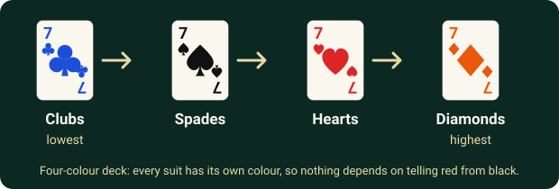

So the **3 of Clubs is the lowest card in the deck** and the **2 of Diamonds is the highest**.

> **Colour code.** Every suit has its own colour in the game and in the pictures on this page: **Clubs are blue, Spades are black, Hearts are red, Diamonds are orange.** Cards also always show the rank and a suit symbol, so you never have to rely on colour alone.

---

## Starting a Round

- The deck is shuffled and each player receives **13 cards**.
- The player holding the **3 of Clubs** plays first, **in every Round**.\*
- That first play is called the **opening move** and it **must include the 3 of Clubs**. It does not have to be a single card: it can be any valid combination that contains the 3♣, such as a Pair, a Triple, or a five-card hand.\*
- Play then continues **clockwise**.

---

## What you can play (combinations)

You never play "just any cards". Each play must be one of the valid combinations below. The pictures show the cards in the order the game displays them.

### Small combinations

| Combination | Cards | Example |
|---|---|---|
| **Single** | 1 card | 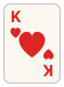 |
| **Pair** | 2 cards of the same rank | 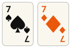 |
| **Triple** | 3 cards of the same rank | 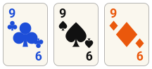 |

**Which one is stronger?**

- **Single:** the higher rank wins. If the ranks match, the higher suit wins.
- **Pair:** the higher rank wins. If both pairs have the same rank, the pair holding the **higher-suit card** wins. For example, `7♠ 7♦` beats `7♣ 7♥`, because the 7♦ outranks the 7♥.
- **Triple:** the higher rank wins.

A Single can only be answered by a stronger Single, a Pair only by a stronger Pair, and a Triple only by a stronger Triple. **You cannot answer a Pair with a Triple, or a Single with a Pair.**

### Five-card combinations

Any five-card play must be one of these five kinds. They are ranked from weakest to strongest:

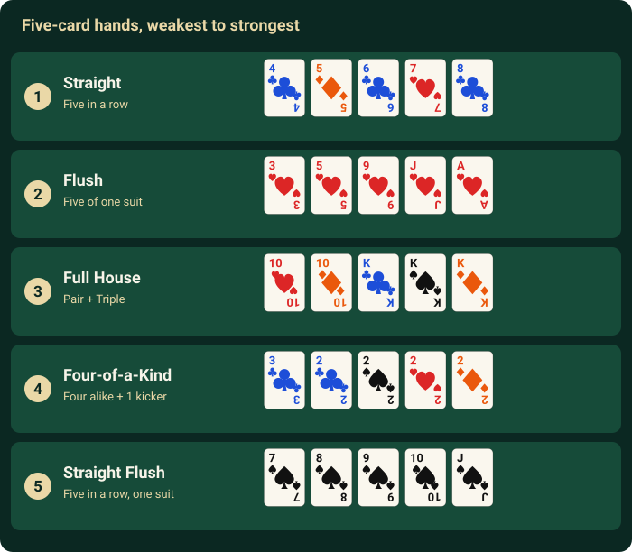

| # | Name | What it is | Example |
|---|---|---|---|
| 1 | **Straight**\* | Five cards in rank order, any suits | 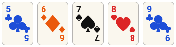 |
| 2 | **Flush**\* | Five cards of one suit, not in sequence | 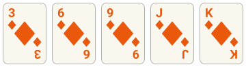 |
| 3 | **Full House** | A Triple plus a Pair | 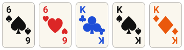 |
| 4 | **Four-of-a-Kind** | Four cards of one rank plus any 1 extra card (the "kicker") | 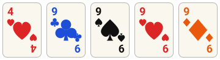 |
| 5 | **Straight Flush** | Five in a row, all one suit | 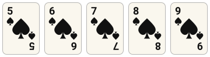 |

A category **always beats every weaker category**, however small its cards. A humble `3-3-3-4-4` Full House beats an Ace-high Flush, and any Straight Flush beats everything else.

#### Straights\*

A Straight is five cards whose ranks run in a row. Suits do not matter. The house rules are:

- Straights run up to the **Ace** and even one step further, to the **2**: `10-J-Q-K-A` and `J-Q-K-A-2` are both valid, and `J-Q-K-A-2` is the **highest** Straight.
- There are **two special low Straights** where the Ace and/or 2 count as low cards. They are the two *weakest* Straights:

  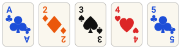 &nbsp; **A-2-3-4-5** (weakest of all)

  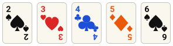 &nbsp; **2-3-4-5-6** (second weakest)

- **No wrap-around.** `K-A-2-3-4` and `Q-K-A-2-3` are **not** Straights:

  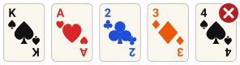 &nbsp; not allowed

- A Straight is ranked by its **top card** (for the two low Straights, that is the 5 and the 6 respectively). So `A-2-3-4-5 < 2-3-4-5-6 < 3-4-5-6-7 < 4-5-6-7-8 < ... < J-Q-K-A-2`.
- If two Straights have the same top rank, the **suit of the top card** decides: Clubs < Spades < Hearts < Diamonds. Here the second Straight wins, because its top card (7♥) outranks the first one's top card (7♣):

  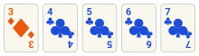 &nbsp;is weaker than&nbsp; 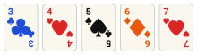

If a set of five cards is both a Straight and a Flush (five in a row, all one suit), it counts as a **Straight Flush**, the higher of the two. [More on that below.](#which-category-does-my-hand-count-as)

#### Flush\*

Compare **suits first**, then ranks. Any Diamonds Flush beats any Hearts Flush, whatever the ranks are; any Hearts Flush beats any Spades Flush, and so on. Only when two Flushes are the **same suit** do you compare cards, starting from the highest card and working down until one is higher.

#### Full House

Ranked by the **Triple only**. The Pair does not matter. `7-7-7-3-3` beats `5-5-5-K-K`, and `K-K-K-2-2` beats `Q-Q-Q-A-A`.

#### Four-of-a-Kind

Ranked by the **four matching cards only**. The kicker can be any card and never affects the comparison. `7-7-7-7-x` beats `6-6-6-6-y` whatever x and y are. There are no special "bomb" powers in this game: Four-of-a-Kind is simply the second-strongest five-card hand.

#### Straight Flush\*

Ranked exactly like a Straight: by the top card, then by its suit. It beats all other five-card hands, and can only be beaten by a stronger Straight Flush.

#### Which category does my hand count as?

You never announce what your five cards are. The game checks them against every category and **automatically gives them the strongest one they qualify for**. You cannot choose a weaker label on purpose, and you never lose value by being counted as the lower type.

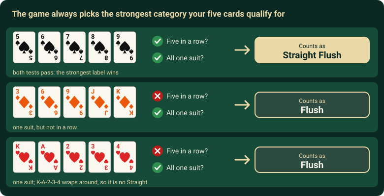

In practice this only matters for one pairing: **Straight + Flush**. A Full House or Four-of-a-Kind needs repeated ranks, so it can never also be a Straight (five different ranks) or a Flush (one deck holds each rank only once per suit).

- **Five in a row, all one suit → Straight Flush, automatically.** It passes the Straight test *and* the Flush test, and Straight Flush is the strongest of the labels it fits. The Play button shows it as "Straight Flush" before you commit.
- **A same-suit Straight is never "just a Flush" or "just a Straight".** Because it counts as a Straight Flush, it beats *every* plain Straight and *every* Flush, however small its cards. For example, `3♠ 4♠ 5♠ 6♠ 7♠` beats an Ace-high Diamonds Flush and even the top Straight `J-Q-K-A-2`.
- **Five of one suit that are *not* in a row → Flush.** Watch the house-rule limits on what counts as "in a row"\*: `K-A-2-3-4` all in Hearts wraps around, so it is not a Straight and therefore only a Flush. The low Straights `A-2-3-4-5` and `2-3-4-5-6` and the high Straight `J-Q-K-A-2` *are* valid, so those in a single suit are Straight Flushes.
- **Five in a row in mixed suits → Straight**, exactly as before.

### Beating a five-card play

A five-card trick can be answered by **any stronger five-card combination**, and the type is allowed to change as long as it gets stronger:

| Current play | It can be beaten by |
|---|---|
| Straight | a higher Straight, or any Flush, Full House, Four-of-a-Kind or Straight Flush |
| Flush | a higher Flush, or any Full House, Four-of-a-Kind or Straight Flush |
| Full House | a higher Full House, or any Four-of-a-Kind or Straight Flush |
| Four-of-a-Kind | a higher Four-of-a-Kind, or any Straight Flush |
| Straight Flush | only a higher Straight Flush |

Once someone answers with a stronger type, that new play becomes the one everyone after them has to beat.

---

## Taking your turn

Play goes **clockwise**. When it is your turn there are two choices:

- **Play** a valid combination that is the *same kind* as the current play and *stronger* than it (or, for five-card plays, any stronger five-card hand), or
- **Pass** and skip this turn.

Passing is always allowed when you are responding, **even if you do have a play available**. Holding back a strong combination for later is a real strategy. Passing does not take you out of the Round, and it does not lock you out of the trick: if somebody plays after you passed, you get another chance to respond when the turn comes back around.

### Tricks and the free lead

A **trick** is one run of plays and passes:

1. Someone leads a combination.
2. The other players, in turn, either beat it or pass.
3. Each time someone plays, the others get a fresh chance to respond.
4. When **everyone else has passed** on the latest play, the trick is over. The player who made that last play **leads the next trick**, and may play **any valid combination** (a "free lead"). You cannot pass on a free lead, because there is nothing to respond to.

Here is one trick with Singles:

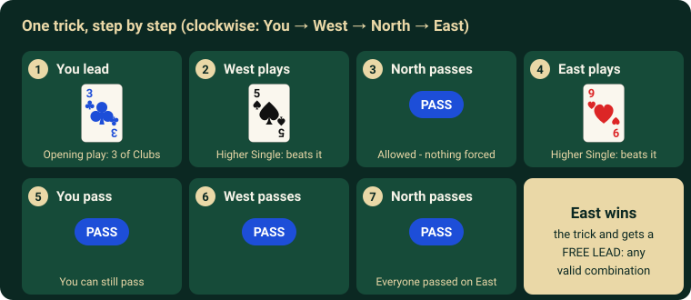

---

## Going out and finishing a Round

When you play your last card(s), you are **out**. You keep your place in the standings and take no further turns in that Round.

The Round does **not** stop when the first player goes out.\* Play carries on until only one player still holds cards:

- The first player out is **1st**, the second **2nd**, the third **3rd**.
- The one player left with cards is automatically **4th**.

When somebody goes out, the players still in the Round each take **their own turn** in response to that last combination, in clockwise order starting from the next player still in the Round\*:

- If you can beat it and want to, play the stronger combination and the trick carries on from there.
- Otherwise you pass (this is a real, visible Pass on your own turn).

If nobody beats it, the next player still in the Round (clockwise from the one who went out) takes the free lead and the Round continues.

---

## Scoring and winning

Each Round awards points by finishing position\*:

| Finish | Points |
|---|---|
| 1st | **+5** |
| 2nd | **+3** |
| 3rd | **+2** |
| 4th | **+0** |

A Session is **exactly five Rounds**\*, so the most you can score is 25 (winning all five) and the least is 0. Your Session score is the total of your five Round scores, and the **highest total wins**.

**If two or more players finish on the same total,** the tie is broken in this order\*:

1. **Most Round wins** (the number of 1st-place finishes).
2. **Best average finishing position** across the five Rounds (a lower average is better).
3. **Highest single Round score.**
4. If they are still level, the game declares a **genuine tie**.

---

## Playing in this app

### Starting

Press **Start Game** on the Home screen. A Session starts straight away: you against three computer opponents, five Rounds, no settings to change. Each Round you see a short "Round N" screen before play begins.

### The table

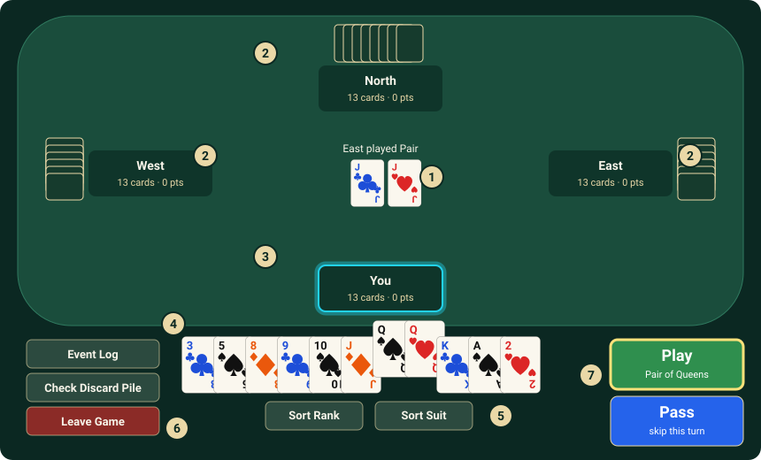

| # | What it is |
|---|---|
| **1** | **The play to beat.** It shows the cards, what kind of combination they are, and who played them. It shows **FREE LEAD** when you may play anything, and **OPENING · 3♣ required** at the start of a Round. It stays on screen through passes until somebody beats it. |
| **2** | **Your three opponents**: West, North and East, with face-down cards, how many they have left, their points, and their latest play. **Turn** marks whose go it is (that player's panel also glows **cyan**), **PASS** shows who passed, and **DONE** shows who has gone out and where they placed (a finished player's panel glows gold, silver or bronze for 1st, 2nd or 3rd). You always sit at the bottom. |
| **3** | **Your panel**: your card count and your points. It glows cyan when it is your turn, as in the picture. |
| **4** | **Your hand.** Click or tap a card to select it, and click or tap it again to deselect. Selected cards rise up. |
| **5** | **Sort Rank** and **Sort Suit** buttons to arrange your hand. |
| **6** | **Event Log** (a history of everything that has happened), **Check Discard Pile** (every card played so far this Round), and **Leave Game**. |
| **7** | **Play** and **Pass**. |

### Playing cards

1. **Select the cards** you want to play. The game will not let you select more cards than can be played: at most five on a free lead, or no more than the number of cards in the play you are answering.
2. Look at the **Play** button. It stays grey while your selection cannot be played and tells you why (for example, that the cards are not a valid combination, or that they do not beat the current play). When your selection is legal it turns **green with a yellow glow** and shows what you are about to play, such as "Pair of Queens".
3. Press **Play**. The cards move to the table and to the Discard Pile.

To skip a turn, press **Pass**. If you have no legal play at all, the Pass button says **No valid plays**. Nothing passes automatically: the game always waits for you on your turn.

### Arranging your hand

- **Sort Rank** puts your cards in rank order (3 up to 2, suits break ties). **Sort Suit** groups them by suit (Clubs, Spades, Hearts, Diamonds), with each suit in rank order.
- You can also **drag a card left or right** to put it wherever you like. Dragging only changes the order. It never selects or deselects anything, and the sort buttons keep your selection too.
- Clicking empty table space does not clear your selection.

### Watching the opponents

The three opponents are computer players. They only act when it is their turn, with a short pause so you can follow each move. Open the **Event Log** or **Check Discard Pile** at any time to review what happened; the game **pauses while either is open** and carries on exactly where it was when you close it.

### End of a Round

When the third player goes out, the Round is over. If a computer player is the one left holding cards, their remaining hand is revealed for a moment (click or tap to skip), and then a **Round Result** window shows the standings, that Round's points, and the new totals. Press **Next Round** to continue. (This window will not go away by accident. Nothing happens until you press the button.)

After Round 5 there is no button to press: the game moves on to the **Session Summary** by itself. It shows the final ranking, all five Rounds and the tiebreak result, and lets you open the **Event Log**, go **Home**, or **Play Again**.

### Leaving

**Leave Game** asks you to confirm first, because a Session in progress is **not saved**. Leave and it is gone. Refreshing or closing the browser tab normally triggers a warning from the browser as well.

### Screen size

Pusoy Dos is played in **landscape**. On a phone, turn the device sideways; if the window is too small or too narrow, the game pauses and asks you to rotate the device or enlarge the window, and it carries on when the size is back to normal.

---

## Tips for new players

These are suggestions, not rules.

- **Count your cards and your opponents' cards.** The numbers next to each seat show who is close to going out. When someone is down to one or two cards, don't let them slip out for free.
- **Get rid of your awkward cards early.** Lone low cards are the hardest to lose, so lead them when you have a free lead. Sorting by Rank makes Pairs and Triples easy to spot, and Sort Suit makes Flushes easy to spot.
- **Save your big cards.** 2s and Aces are excellent at winning a trick, so you will often want to keep them for the moments that matter.
- **Passing is a plan.** It is fine to let a low trick go and keep your strong combination for when you have the lead.
- **Watch for five-card hands.** They are a good way to shed five cards at once, and stronger ones will beat a five-card play whatever cards it uses.
- **Lead with the combination you are most likely to win with.** Once you win a trick, you set the pace for the next one.

---

## House rules at a glance

These are the rules marked with \* above.

| Rule | How this game plays it |
|---|---|
| Suit order | Clubs < Spades < Hearts < Diamonds |
| Who starts | The holder of the 3♣, at the start of **every** Round |
| Opening play | Any valid combination that includes the 3♣ |
| Straights | `A-2-3-4-5` and `2-3-4-5-6` are the two lowest; `J-Q-K-A-2` is the highest; no wrap-around (`K-A-2-3-4` is invalid); ranked by top card, then top card's suit |
| Flush | Compared by suit first, then highest card down |
| Straight Flush | Ranked like a Straight; a same-suit Straight is always a Straight Flush |
| Round end | The Round continues until three players are out; the last player left is 4th |
| Going out | Everyone still in gets their own turn (play or Pass) before the next free lead |
| Points | 1st = 5, 2nd = 3, 3rd = 2, 4th = 0 |
| Session length | Exactly 5 Rounds (maximum 25 points) |
| Tie-breaks | Most Round wins, then best average finish, then best single-Round score, then a genuine tie |

---

## Quick reference

**Card order (low to high):** `3 4 5 6 7 8 9 10 J Q K A 2`

**Suit order (low to high):** Clubs (blue) < Spades (black) < Hearts (red) < Diamonds (orange)

**Combinations:**

| Cards | Name | Beaten by |
|---|---|---|
| 1 | Single | a higher Single |
| 2 | Pair | a higher Pair |
| 3 | Triple | a higher Triple |
| 5 | Straight < Flush < Full House < Four-of-a-Kind < Straight Flush | any stronger five-card hand |

**Turn:** play something stronger of the same kind, or pass. When everyone else passes on your play, you lead again.

**Points per Round:** 5 / 3 / 2 / 0. **Five Rounds** per Session.

---

## FAQ

**Can I pass even if I could play?**
Yes. A strategic pass is always allowed when you are answering a play. The one exception is a free lead (or the opening play), where you must play something.

**Can I answer a Pair with a Triple, or a Single with a Pair?**
No. Singles, Pairs and Triples can only be answered by the same kind, stronger. Only five-card plays can be answered by a different (stronger) kind.

**Is the 2 really higher than the Ace?**
Yes. 2 is the highest rank. Among suits, the 2♦ is the single strongest card.

**Are 2s, Four-of-a-Kinds or Straight Flushes "bombs"?**
Not in this game. They are simply strong cards or hands. The only special power of a strong five-card hand is that it beats any weaker five-card hand.

**Is `A-2-3-4-5` a Straight? What about `K-A-2-3-4`?**
`A-2-3-4-5` is valid\*, and it is the weakest Straight. `K-A-2-3-4` is not valid\*. There is no wrap-around.

**Does a high Pair make a Full House stronger?**
No. Only the Triple counts. `5-5-5-K-K` loses to `7-7-7-3-3`.

**What happens when a player goes out in the middle of a trick?**
Players still in the Round each take their own turn in response to that player's last combination. If nobody plays a stronger one, the next player still in the Round takes the free lead.\*

**Who leads the second Round?**
Whoever holds the 3♣ in the freshly dealt hands, just like in the first.\*

**Can I save my game and finish later?**
No. A Session in progress is not saved, and leaving it ends it.
